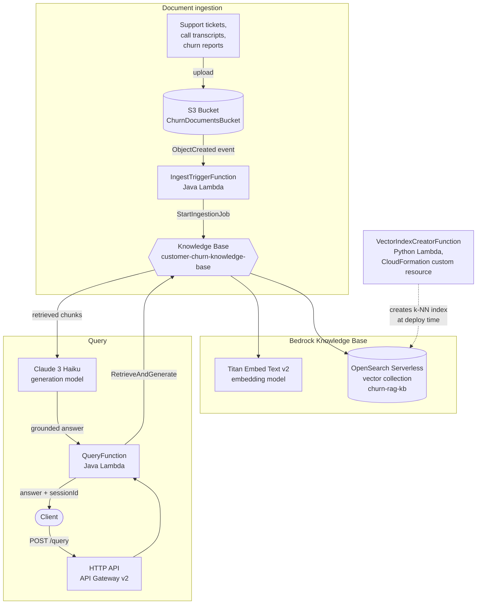

# customer-churn-rag

A retrieval-augmented generation (RAG) pipeline for customer-churn analysis, built on AWS CDK (Java). Support tickets, call transcripts, and churn reports dropped into S3 are automatically chunked, embedded, and indexed into a Bedrock Knowledge Base, which a query API uses to answer questions with grounded, cited responses.

## Architecture



**Ingestion path:** documents land in the `ChurnDocumentsBucket`, which triggers `IngestTriggerFunction` on every `ObjectCreated` event. It calls `bedrock:StartIngestionJob`, and the Knowledge Base chunks the new documents (fixed-size, 500 tokens, 20% overlap), embeds them with Titan Embed Text v2, and writes the vectors into the OpenSearch Serverless collection.

**Query path:** a client calls `POST /query` on the HTTP API with `{ "question": "..." }`. `QueryFunction` forwards it to Bedrock's `RetrieveAndGenerate`, which retrieves the most relevant chunks from the Knowledge Base and generates a grounded answer with Claude 3 Haiku.

**Index bootstrap:** CloudFormation has no native resource for an OpenSearch Serverless vector index, so `VectorIndexCreatorFunction` (Python) is invoked once at deploy time via a custom resource to create the k-NN index the Knowledge Base depends on.

## Project structure

```
src/main/java/com/example/churnrag/
├── ChurnRagApp.java              # CDK app entrypoint
├── ChurnRagStack.java            # Full stack definition
└── lambda/
    ├── IngestTriggerHandler.java # S3 -> StartIngestionJob
    └── QueryHandler.java         # POST /query -> RetrieveAndGenerate
lambda/index-creator/index.py     # CFN custom resource: creates the OpenSearch Serverless vector index
```

## Deploying

Requires Node 18+ (for the AWS CDK CLI) and Java 21.

```bash
npm install -g aws-cdk

./gradlew shadowJar   # builds the fat jar used by both Lambda handlers
cdk synth              # validate the stack
cdk deploy              # deploy to your configured AWS account/region
```

## Usage

```bash
curl -X POST "$API_ENDPOINT/query" \
  -H "Content-Type: application/json" \
  -d '{"question": "Why are enterprise customers churning this quarter?"}'
```

Upload documents to the `ChurnDocumentsBucket` (see the `DocumentBucketName` stack output) to add them to the knowledge base — ingestion kicks off automatically.
